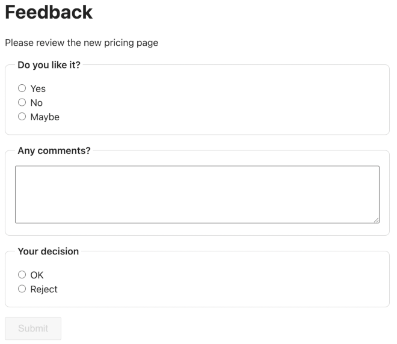

# ask-feedback

A small, self-hosted tool to collect structured feedback: create a feedback
request (a briefing, an optional single-choice question, an optional free-text
question), send the link to someone, and they answer it once — a required
OK/Reject decision plus their choice/text answers. Can be used from agents, workflows (n8n, step functions), plugins. 



It's built from three pieces:

- **`cdk/`** — an AWS CDK (TypeScript) stack: a DynamoDB table (on-demand),
  an API Gateway REST API backed by three Lambdas (create / get / answer),
  and an S3 bucket that serves the static client as a website.
- **`client/`** — a single `index.html` using [petite-vue](https://github.com/vuejs/petite-vue)
  from a public CDN. No build step. Reads the feedback ID from `?id=...` in
  the URL and talks to the API via `config.js`.
- **`test-api/`** — a local, in-memory Express server that mirrors the same
  three endpoints, so you can develop/test the client without deploying
  anything to AWS.
- **`mcp/`** — a local MCP server exposing the three API endpoints as tools,
  so an agent (e.g. Claude Desktop) can create and check on feedback
  requests directly.

## API

| Method | Path                              | Auth              | Purpose                              |
| ------ | --------------------------------- | ----------------- | ------------------------------------- |
| POST   | `/feedback-requests`              | create API key (header `x-api-key`) | Create a feedback request, returns `{ id, answerUrl }` |
| GET    | `/feedback-requests/{id}`         | public API key (header `x-api-key`) | Fetch a feedback request (404 if the ID is wrong/unknown) |
| POST   | `/feedback-requests/{id}/answer`  | public API key (header `x-api-key`) | Answer once; 409 if already answered |

`POST /feedback-requests` body:

```json
{
  "briefing": "Please review the new pricing page",
  "choiceQuestion": "Do you like it?",
  "choiceOptions": ["Yes", "No", "Maybe"],
  "textQuestion": "Any comments?",
  "webhookUrl": "https://example.com/hooks/feedback-answered",
  "taskToken": "aabbcc123"
}
```

`choiceQuestion`/`choiceOptions`, `textQuestion`, `webhookUrl`, `taskToken` are
optional; `briefing` is required. `choiceOptions` is required if
`choiceQuestion` is set. `webhookUrl`, if given, must be an `http(s)` URL.
`taskToken`, if given, must be a token `$$.Task.Token`. from a step function step marked `.waitForTaskToken`.
Can have either a webhook or a task token.

The response, `{ "id": "...", "answerUrl": "https://.../?id=..." }`,
includes a ready-to-share link to the deployed client (the site bucket's
website URL, or `CLIENT_BASE_URL` for the test API) — no need to build it
yourself.

`POST /feedback-requests/{id}/answer` body:

```json
{ "choiceAnswer": "Yes", "textAnswer": "Looks great", "decision": "ok" }
```

`decision` (`"ok"` or `"reject"`) is required; `choiceAnswer`/`textAnswer`
are optional and only meaningful if the request had those questions.

### Webhook

If `webhookUrl` was passed at creation, a successful `answer` fires a single
`POST` to that URL with:

```json
{ "id": "<feedback id>", "choiceAnswer": "Yes", "textAnswer": "Looks great", "decision": "ok" }
```

Delivery is best-effort: it isn't retried, and a failing/slow webhook (5s
timeout) never blocks the answer from being recorded or returns an error to
the answerer. `webhookUrl` itself is never exposed by `GET
/feedback-requests/{id}`, so it stays private to whoever created the request.

### API keys and throttling

Every method requires an API key, but there are two, on separate usage
plans, throttled independently:

- **create key** — kept secret, used only to call `POST /feedback-requests`.
  Throttled to 5 req/min.
- **public key** — shipped in the deployed `config.js` and used by the
  browser client for `GET`/`answer`. Throttled to 15 req/min. It's public by
  design (there's no login for answering feedback), so it exists only to
  give get/answer their own throttle bucket separate from the create key —
  not as a real access control.

API Gateway's `apiKeyRequired` only checks that *some* key on a usage plan
associated with the stage was used - it doesn't stop the public key from
also authenticating against `POST /feedback-requests`. `create.ts` closes
that gap itself: it reads which key id was actually used
(`event.requestContext.identity.apiKeyId`) and rejects the request with 403
unless it matches the create key specifically.

## MCP server

`mcp/index.js` is a local [MCP](https://modelcontextprotocol.io) server
(stdio transport) exposing three tools that call the corresponding API
endpoints: `create_feedback_request`, `get_feedback_request`, and
`answer_feedback_request`. It works against either the deployed API or the
local test API — point it at whichever via environment variables:

| Variable                       | Required for                          |
| ------------------------------- | -------------------------------------- |
| `ASK_FEEDBACK_API_URL`          | all tools (e.g. the `ApiUrl` deploy output, or `http://localhost:3001`) |
| `ASK_FEEDBACK_CREATE_API_KEY`   | `create_feedback_request`             |
| `ASK_FEEDBACK_PUBLIC_API_KEY`   | `get_feedback_request`, `answer_feedback_request` |

Run it directly with `npm run mcp` (after `npm run install:all`), or point
an MCP client at `node <repo>/mcp/index.js`.

### Claude Desktop

Add an entry to Claude Desktop's config file (macOS:
`~/Library/Application Support/Claude/claude_desktop_config.json`; Windows:
`%APPDATA%\Claude\claude_desktop_config.json`), then restart Claude Desktop:

```json
{
  "mcpServers": {
    "ask-feedback": {
      "command": "node",
      "args": ["/absolute/path/to/ask-feedback/mcp/index.js"],
      "env": {
        "ASK_FEEDBACK_API_URL": "https://<api-id>.execute-api.<region>.amazonaws.com/prod/",
        "ASK_FEEDBACK_CREATE_API_KEY": "<create key value>",
        "ASK_FEEDBACK_PUBLIC_API_KEY": "<public key value>"
      }
    }
  }
}
```

Use absolute paths for `args`, and the real values from `cdk deploy`'s
output (see "Deploying to AWS" below) for the env vars — or point
`ASK_FEEDBACK_API_URL` at `http://localhost:3001` with the test API running:
`ASK_FEEDBACK_CREATE_API_KEY` must then match the test API's key (`local-dev-key`
by default), and `ASK_FEEDBACK_PUBLIC_API_KEY` can be any non-empty value
since the test API doesn't check it for `get`/`answer`.

## Quickstart

```bash
npm run install:all      # installs cdk/, test-api/ and mcp/ dependencies

npm run test-api         # local in-memory API on http://localhost:3001
npm run client           # serves client/ on http://localhost:5173 (uses client/config.js)
```

Then open `http://localhost:5173/index.html?id=<some-id>` — create an ID
first via:

```bash
curl -X POST http://localhost:3001/feedback-requests \
  -H "Content-Type: application/json" -H "x-api-key: local-dev-key" \
  -d '{"briefing":"Please review the new pricing page","choiceQuestion":"Do you like it?","choiceOptions":["Yes","No","Maybe"],"textQuestion":"Any comments?"}'
```

The test API is in-memory only — its state resets whenever you restart it.

Run `npm run cdk:test` for the CDK stack's tests: a CloudFormation snapshot
test plus unit tests for the three Lambda handlers (mocking DynamoDB and
`fetch` with `aws-sdk-client-mock`).

### Deploying to AWS

Requires an AWS account/credentials available to the CDK CLI (e.g. via
`aws configure` or environment variables), and the CDK bootstrap to have run
once per account/region.

```bash
npm run cdk:bootstrap    # one-time per account/region
npm run cdk:synth
npm run cdk:diff
npm run cdk:deploy
```

The deploy output includes the API URL, the two API key IDs (fetch a key's
value with `aws apigateway get-api-key --api-key <KeyId> --include-value`),
the S3 website URL, and the DynamoDB table name. The public key is also
already embedded in the deployed `config.js` — you only need to look it up
yourself for the create key.

The S3 bucket name is generated as `ask-feedback-web-<hash>`, where `<hash>`
is a hash of the AWS account ID — this keeps the name globally unique (S3
requirement) and lets the same stack be deployed into multiple accounts
without collisions, without putting the raw account number in the bucket
name.

`client/config.js` is checked in with a `localhost:3001`/`apiKey` default for
local development; on deploy, the CDK stack overwrites it in the S3 bucket
with the real API URL and the deployed public key, so the deployed client
always points at the deployed API.

The public key value is deterministic (derived from the account id and stack
name) rather than randomly generated, so redeploying the same stack doesn't
rotate it and force a fresh `config.js` deploy.

To create a feedback request against the deployed API, use the **create**
API key from the deploy output and call `POST {ApiUrl}feedback-requests` as
shown above, then share the `answerUrl` from the response with whoever
should answer it.

## License

[MIT](LICENSE)
